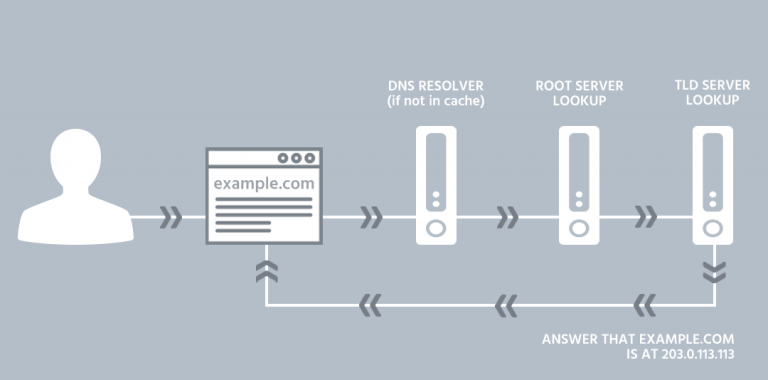

# What happens when you type www.example.com 

 The domain name system (DNS) is a naming database that locates and translates internet domain names into IP addresses

An IP address is given to each device on the Internet, and that address is necessary to find the appropriate Internet device 

DNS resolution translates the domain name into an IP address, allowing your web browser to establish a connection to the server hosting the website. Data transmission occurs as the server sends the requested web page content back to your web browser for display.

1. When you enter `www.example.com` into the search bar. The web browser first checks if it already has an IP address for the URL. This is known as a DNS look up. 
 
2. If the DNS server has the IP address cached, it returns it to your web browser.

3.  If not - it sends its own DNS query to other DNS servers to find the IP address.
   

4. The web browser then initiates a TCP connection to the IP address received from the DNS server.

5. It sends a HTTP request to the server at that IP address, asking for the web page located at `www.example.com`

Below is an example of the **Structure  of the request**

   
6. The server at "www.example.com" receives the request and processes it. It locates the requested web page and prepares to send it back to your web browser.
   
7. The server sends the web page data in the form of HTTP (Hypertext Transfer Protocol) response packets back to your web browser over the established TCP connection.

**Below is an example of an HTTP response :**

> [!IMPORTANT]  
> **Common status codes include:**  
>  **200 (OK, request succeeded)**  
> **404 (Not Found, the resource can’t be found)**  
> **500 (Internal Server Error)**
        

8. Your web browser receives the responses and interprets them to the web page on your screen.
And now you see the content of "www.example.com" displayed in your web browser.