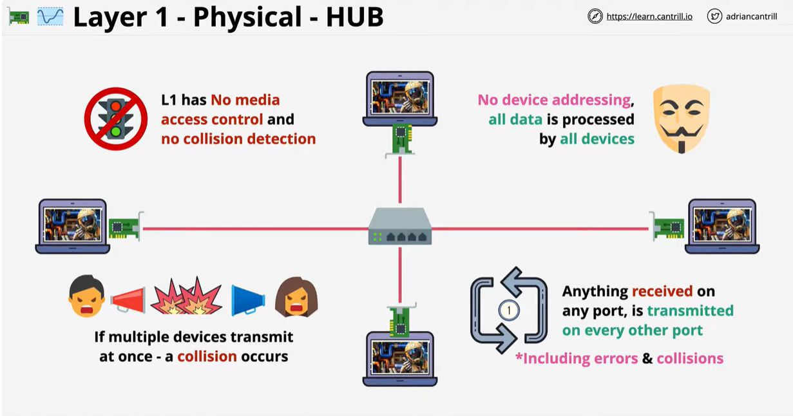
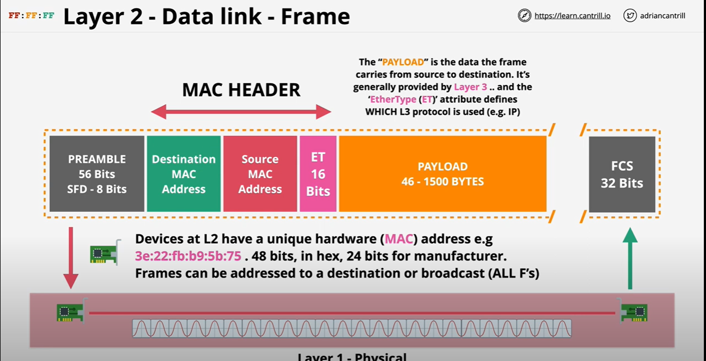

## Table of contents:
- [Networking](#networking)
- [What Is the OSI Model](#what-is-the-osi-model)
- [Layer 1 - Physical layer](#layer-1---physical-layer)
- [Layer 2 - Data link layer](#layer-2---data-link-layer)
- [Layer 3 - Network layer](#layer-3---network-layer)
# Networking

- Networking is a fundamental component of DevOps practices
   - enabling seamless **communication** 
   -  **collaboration** between development, operations, and other stakeholders.
- DevOps engineers play a crucial role in ensuring that networking
infrastructure:
  - supports the **continuous integration, delivery, and deployment** 
  -  **optimize** application performance
  - **Enhance security**
   - **Troubleshoot** issues effectively. 
  
# What Is the OSI Model
The Open Systems Interconnection (OSI) model describes seven layers that computer systems use to communicate over a network.

# Layer 1 - Physical layer

- The Physical Layer serves as the foundation of the OSI Model, focusing on the actual transmission of data in its raw bit form over a physical medium. Focuses on the physical shared medium 
- standard for transmitting and receiving from the medium 
-  The Physical Layer doesn't define any particular meaning for those signals other than the basic binary values 0 and 1.
 

- Layer1 has **ONE** broadcast and **ONE** division main : Layer 1 networks don't scale very well. Has higher chance of collisions and data corruption as it RE- TRANSMITS EVERYTHING
  
> [!IMPORTANT]  
> **No access control  
> No uniquely identified devices   
> No device => device communications**
> 

#  Layer 2 - Data link layer

-  Layer two relies on functional layer one networks, which provide various capabilities to higher layers.
-   Layer one handles the physical transmission and reception of frames while **layer two provides them for communication.**
     ## Framing
    - One of the key functions of the Data Link Layer is to divide the stream of bits received from the Physical Layer into manageable frames
    - Framing allows devices to recognize the start and end of each transmission.
    -  This process ensures that data is correctly segmented for transmission over the network.
      ## Network devices
     - The Data Link Layer is crucial for the operation of network devices like switches
     - use MAC addresses to determine how to forward frames
     - This capability enables switches to efficiently direct data only to the specific port where the destination device is connected, **minimizing network congestion and enhancing overall network performance**
      ## Mac Adress:
     - MAC addresses are unique identifiers assigned to network interface cards (NICs) or network adapters.  48-bit long  `00:1b:63:84:45:e6`. These addresses are used to identify devices on a local network segment.
     - When a device wants to send data to another device within the same network, it uses the recipient's MAC address to direct the frame to the correct destination.
     -  The Data Link Layer is **responsible for adding the MAC address information to the frame's header.**
   

  

  
#  Layer 3 - Network layer

