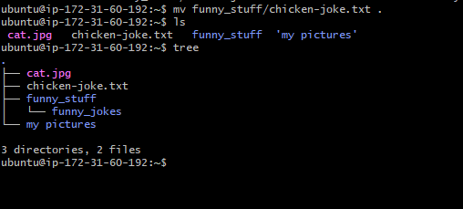
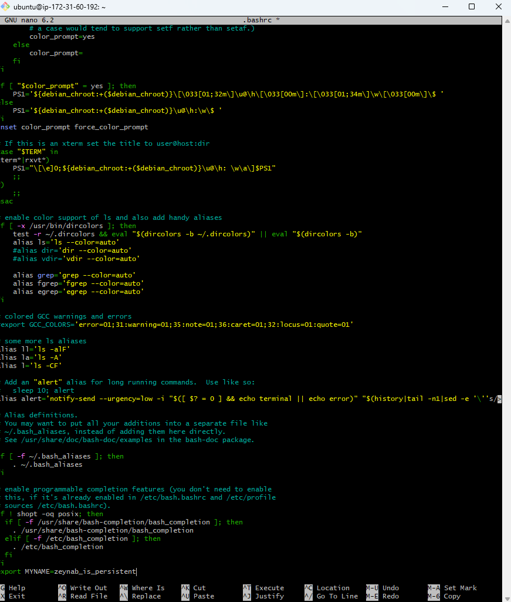
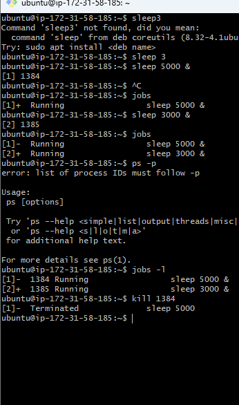

# Table of contents:

- [Table of contents:](#table-of-contents)
- [What is Linux?](#what-is-linux)
      - [Why is it so popular?](#why-is-it-so-popular)
  - [ Linux Commands for System Information: ](#-linux-commands-for-system-information-)
  - [ User and System Information: ](#-user-and-system-information-)
  - [ Process Information and History: ](#-process-information-and-history-)
  - [ Working with Files and Directories: ](#-working-with-files-and-directories-)
  - [ Downloading an image: ](#-downloading-an-image-)
  - [ File and Directory Manipulation: ](#-file-and-directory-manipulation-)
  - [ File Creation and Editing: ](#-file-creation-and-editing-)
  - [ Viewing File Content ](#-viewing-file-content-)
  - [ Searching within a Files: ](#-searching-within-a-files-)
  - [ Moving files : ](#-moving-files--)
  - [ Adding and Removing Files: ](#-adding-and-removing-files-)
  - [ tree: ](#-tree-)
  - [ Permission Groups: ](#-permission-groups-)
  - [ Changing File Permissions: ](#-changing-file-permissions-)
  - [ Making a Basic Shell Script: ](#-making-a-basic-shell-script-)
      - [Running the Script:](#running-the-script)
  - [ Making a persistent environment variable: ](#-making-a-persistent-environment-variable-)
  - [How to view information about processes running on the system:](#how-to-view-information-about-processes-running-on-the-system)
    - [Parent and Child Processes:](#parent-and-child-processes)
  - [When managing processes:](#when-managing-processes)
    - [Managing Processes:](#managing-processes)
    - [kill Command:](#kill-command)

# What is Linux?

Linux is an open-source operating system that serves as the foundation for various Linux distributions

#### Why is it so popular?

- **Open Source:** Linux is open-source, enabling collaborative development and innovation.
- **Stability and Reliability:** Linux is renowned for its stability and reliability, making it ideal for critical systems.
- **Security:** Linux offers robust security features to safeguard systems and data.
- **Customizability:** Linux allows users to customize their systems according to their specific requirements.
- **Cost-Effective:** Linux is free to use, reducing software licensing costs.

##  Linux Commands for System Information: 

`uname` 
 -  Displays system information about the operating system.

`uname --help`
  - Provides help and usage information for the uname command.

`uname --processor`
-  Prints the processor (CPU) type or architecture.

`uname -n` 
- Shows the network (host) name of the machine.

`uname -a` 
-  Prints all system information, including kernel version and architecture.

##  User and System Information: 
 `whoami`  
- Displays the username of the current user.

`pwd`
- Prints the current working directory.

`cat /etc/shells` 
-  Lists the available shells on the system.
##  Process Information and History: 
`ps -p $$`
- Shows process information for the current shell.

`history` 
-  Displays a list of previously executed commands.

`history -c`
-  Clears the command history.

##  Working with Files and Directories: 

`ls -a` or `ll or ls -a` 
- Lists all files and directories, including hidden ones.

`mv source destination`  
- Moves or renames a file.

`cp source destination` 
- Copies a file.

##  Downloading an image: 

`curl https://cdn.britannica.com/39/7139-050-A88818BB/Himalayan-chocolate-point.jpg --output cat.jpg`
- Downloads a file from a specified URL and saves it with the given filename.
file filename: Outputs the type of file.

`file cat.jpg`
 - outputs whattype of file it is

`mv cat.jpg cat` 
 - Moves or renames a file.
 
`cp cat cat.jpg`
 - Copies a file.
##  File and Directory Manipulation: 
`rm cat`
- Removes the file named "cat".

 `mkdir funny_stuff`
- Creates a directory named "funny_stuff".

`rm -r`  OR  `rm -rf`
- Removes directories recursively. `-r` stands for recursive, and `-f` stands for force, which removes without confirmation.

##  File Creation and Editing: 

`touch filename`
- Creates an empty file with the specified filename.

`nano chicken-joke.txt`
- Opens the nano text editor to create or edit the "chicken-joke.txt" file.

`cat chicken-joke.txt` 
- Displays the contents of the "chicken-joke.txt" file.

##  Viewing File Content 

`head -2 chicken-joke.txt`
- Displays the first 2 lines of the "chicken-joke.txt" file.

`tail -2 chicken-joke.txt`
- Displays the last 2 lines of the "chicken-joke.txt" file.

`cat -n chicken-joke.txt`
- Displays the contents of the "chicken-joke.txt" file with line numbers.

##  Searching within a Files: 

`grep "chicken" chicken-joke.txt`

- Searches for the word "chicken" in the "chicken-joke.txt" file and displays matching lines.

##  Moving files : 

`mv chicken-joke.txt funny_stuff/` 
- Moves the file "chicken-joke.txt" to the directory "funny_stuff".

`mv funny_stuff/chicken-joke.txt .` 
-  Moves the file "chicken-joke.txt" to the "funny_jokes" directory inside the "funny_stuff" directory

`mv funny_stuff/funny_jokes/chicken-joke.txt funny_stuff/funny_jokes/bad_joke.txt` \
- Renames the file "chicken-joke.txt" to "bad_joke.txt" inside the "funny_jokes" directory.

##  Adding and Removing Files: 

`nano provision.sh`
- Opens the nano text editor to create or edit a shell script named "provision.sh"

`chmod u+x provision.sh`
- Grants execute permission to the owner (user) of the file "provision.sh".

##  tree: 

`tree`  displays directory structures in a tree-like format. It recursively lists all directories and files within a specified directory and its subdirectories.

The tree command provides a visual representation of the directory hierarchy, making it easier to navigate and understand the organization of files and folders within a system. 

##  Permission Groups: 

- **User, Group, Others:** Refers to the three categories of users who may have permissions on a file or directory.
- **Read/Write/Execute:** Represents the different types of permissions that can be assigned to each group.

##  Changing File Permissions: 

- `chmod 777 provision.sh:` Grants read, write, and execute permissions to all users for the file "provision.sh"

##  Making a Basic Shell Script: 

`#!/bin/bash`
- Declares the type of shell to be used in the script (in this case, Bash).

#### Running the Script:
1. `sh provision.sh`
2. `bash provision.sh`
3. `./provision.sh`

##  Making a persistent environment variable: 

`printenv USER`  displays the value of the USER environment variable.

_However, these changes are temporary and will be lost when you log out or close the terminal session._

To make the environment variable persist across sessions:
- add the variable assignment (MYNAME=zeynab) to the **.bashrc file** in your home directory. 
- This file is executed every time you start a new Bash shell session,
- You can edit the **.bashrc file** using `nano .bashrc` and add the variable assignment at the end of the file.

## How to view information about processes running on the system:

`ps aux` 
- This command displays information about all running processes.
  
`top` 
- This command provides a dynamic real-time view of running system processes. Some useful shortcuts within top
  
**SHIFT + P: Sort processes by CPU usage**.  
**SHIFT + M: Sort processes by memory usage.**  
**SHIFT + N: Sort processes by newest.**

### Parent and Child Processes:
In Linux, processes can have parent-child relationships:

1. **Parent Processes:** These are processes that spawn other processes, known as child processes.
2. **Child Processes: **These are processes created by other processes, known as parent processes.

## When managing processes:

1. Control: A parent process typically controls its child process.
2. Process ID (PID): Each process has a unique process ID.
3. Zombie Processes: If a parent process is forcibly killed while its child process remains active, the child process may become a zombie process.

### Managing Processes:
- `sleep 300`: This command suspends execution for 300 seconds.

### kill Command:

- `kill -15 PID`: Sends a termination signal (SIGTERM) to the specified process ID.
- `kill -9 PID`: Sends a forceful termination signal (SIGKILL) to the specified process ID, forcibly terminating it.

