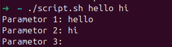
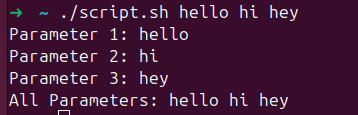

# zshrc file

1. open the file : `nano ~/.zshrc`
2. And then set the ZSH_THEME value to whatever value you want to use like this:
`ZSH_THEME="robbyrussell"`
### If having trouble with zsh files,  delete then redownlaod:

`rm -rf ~/.oh-my-zsh`
`rm ~/.zshrc`
`cp ~/.zshrc.pre-oh-my-zsh ~/.zshrc`
`source ~/.zshrc`
#### after that install again
`sh -c "$(curl -fsSL https://raw.githubusercontent.com/ohmyzsh/ohmyzsh/master/tools/install.sh)"`


# Scripting

How to run a script from anywhere without specifing the path

1. Place the file in the PATH. run: `echo $PATH` . Any file in this directories can be run from anywhere
2. choose a file path for e.g: `/usr/local/bin` Type: `sudo mv name-of-file.sh /usr/local/bin/name-of-file`
3. chmod as this is a script : `sudo chmod +x /usr/local/bin/name-of-file`
4. *now you can run the `name-of-the-file` withought using bash or .sh. It will still run in ANY directory*


# Comments: 

```bash
#!/bin/bash 

echo "Hello World" 

# This is a commment 


# Renaming all .txt files to .bk using for loop:

#for file in *.txt; do
#   mv "$file" "$(file%.txt).bak"
#done

: ' 

Looping through all .txt files in the current directory using the mv command to rename each .txt file to .bk
The '$(file%.txt).bak' is the syntax that removes the .txt extension and appends .bak

' 
```
# Variables

 - Bash variables are like containers that hold different data types, including strings, numbers, and arrays.
 -  To create a variable, simply assign a value to it using the assignment operator, and access its value by preceding the variable name with a dollar sign.
 -   Variables can hold various data types, and Bash also allows for dynamic string output using variable interpolation. 
 -   open a file text editor e.g: `nano var.sh` OR `vi var.sh` 
 -   type: 
```bash                                                      
#!/bin/bash

greeting="Hello World!!"


# To access the value :
echo $greeting

```

- run: `chmod +x var.sh`
- Then: `./var.sh` # output: Hello World!
- 
## variable interpolation

```bash
#!/bin/bash

greeting="Hello World!!"
count=42
fruits=("apple", "banana", "orange")

name="Ahmed"

echo  "Hello,  $name"

```

# Parameters

- The parameters are accessed using dollar signs followed by the number representing their position, such as $1 for the first parameter. 
-  a special variable, $, followed by @, to echo all parameters passed to the script. 
-  By allowing inputs through parameters, scripts become more **interactive and versatile.**
-  For example: `./script.sh parameter1 parameter2`
-  open scrtipt:
```bash

  #!/bin/bash


echo "Parameter 1: $1"
echo "Parameter 2: $2"
echo "Parameter 3: $3"

```
- Run file `./script.sh hello hi`


- Output : 
  <br>

  
## How to access ALL the parameters: 


```bash
#!/bin/bash


echo "Parameter 1: $1"
echo "Parameter 2: $2"
echo "Parameter 3: $3"

echo "All Parameters: $@"

```

output: 
<br>

  

